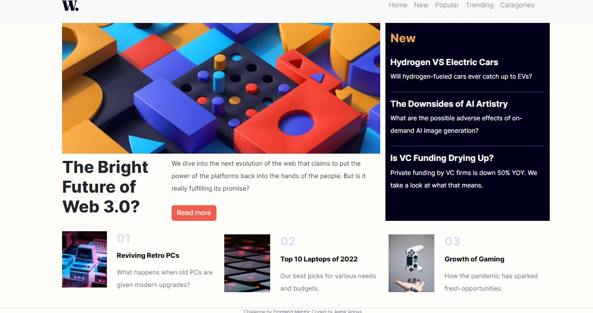

# Frontend Mentor - News homepage solution

This is a solution to the [News homepage challenge on Frontend Mentor](https://www.frontendmentor.io/challenges/news-homepage-H6SWTa1MFl). Frontend Mentor challenges help you improve your coding skills by building realistic projects.

## Table of contents

- [Overview](#overview)
  - [The challenge](#the-challenge)
  - [Screenshot](#screenshot)
  - [Links](#links)
- [My process](#my-process)
  - [Built with](#built-with)
  - [What I learned](#what-i-learned)
  - [Continued development](#continued-development)
  - [Useful resources](#useful-resources)
- [Author](#author)
- [Acknowledgments](#acknowledgments)

## Overview

### The challenge

Users should be able to:

- View the optimal layout for the interface depending on their device's screen size
- See hover and focus states for all interactive elements on the page
- **Bonus**: Toggle the mobile menu (requires some JavaScript)

### Screenshot



### Links

- Solution URL: [Github Public Repository](https://github.com/aamirabbas01/aamirabbas01.github.io/tree/master/news-homepage-main)
- Live Site URL: [Github live demo site](https://aamirabbas01.github.io/news-homepage-main/)

## My process

### Built with

- Semantic HTML5 markup
- CSS custom properties
- BootStrap 5
- Desktop-first workflow

### What I learned

I have learned to build a basic page withe HTML, CSS and bootstrap 5. I have not used JavaScript so that i could learn more about bootstrap classes.

```html
<h1>Some HTML code I'm proud of</h1>
```

```css
@media only screen and (max-width: 400px) {
  -Customization for mobile screens
}
```

### Continued development

In the next challange I will use JavaScript and dig more into bootstrap 5.

### Useful resources

- [W3schools.com](https://www.w3schools.com) - I learned all the CSS and bootstrap 5 from here and answered all the quizes and exercises.
- [Bootstrap Official Site](https://getbootstrap.com) - I took the reference about the class to be used.
- [Mobile Custom Menus](https://dev.to/codeply/bootstrap-5-sidebar-examples-38pb) - I took the example from this side to create curtain menu.

## Author

- Website - [Aamir Abbas](https://aamirabbas01.github.io/news-homepage-main/)
- Frontend Mentor - [@aamirabbas01](https://www.frontendmentor.io/profile/aamirabbas01)

## Acknowledgments

The facebook group of HTML, CSS and JavaScript helped to find this site and learn designing which I had not learned for 13 years although I am a ASP.NET programmer.

```

```
